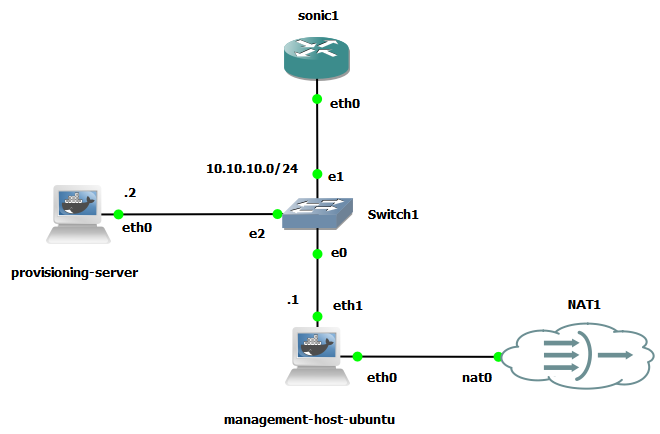

# Introduction

This project demonstrates Zero-Touch Provisioning for SONiC VS in GNS3 by building a ZTP-enabled SONiC virtual switch image, deploying a lab topology with separate DHCP and provisioning servers, and validating the complete automated bootstrap workflow from first boot to applied configuration. It shows how a SONiC switch with no startup configuration can obtain network settings through DHCP, learn the location of a `ztp.json` file, download provisioning artifacts such as `config_db.json`, and automatically transition into an operational state without manual intervention.

## Zero-touch Provisioning (ZTP)

Zero-Touch Provisioning (ZTP) is an automated process that enables a network device to configure itself during its initial boot, without manual intervention. It is especially useful in data center environments, where large numbers of switches must be deployed quickly and consistently.

When a SONiC switch starts for the first time, it boots in an unconfigured state and initiates the ZTP workflow. During this process, the device establishes basic network connectivity, discovers provisioning resources, and retrieves the required artifacts such as configuration files, scripts, or software images from the network. Once provisioning completes, the switch transitions into a fully operational state, ready to participate in the network according to the operator-defined configuration.

- Refer to [this guide](./README_ZTP_IMG.md) to build a SONiC VS image with ZTP enabled.
- Refer to [this guide](./README_ZTP_Flow.md) for an overview of the SONiC ZTP execution flow.

## GNS3 Topology

The GNS3 topology used in this lab environment represents a simplified network designed to demonstrate the ZTP workflow. In this topology, the SONiC switch (`sonic1`) boots without configuration but has the ZTP feature enabled. Upon startup, the switch attempts to establish connectivity through its management interface (`eth0`) by sending DHCP discovery messages to the network.



The management host acts as the DHCP server in this environment. Its responsibility is to assign an IP address and other network parameters such as the subnet mask, default gateway, and DNS servers. In addition to these basic settings, the DHCP server includes additional options that specify the location of provisioning resources required by ZTP.

The provisioning server is a separate system that hosts the artifacts required for automated configuration. In this lab it provides the `ztp.json` file and other related resources such as configuration files. These artifacts are typically hosted on standard services such as HTTP, HTTPS, or TFTP. When the SONiC switch receives the provisioning URL from the DHCP server, it contacts the provisioning server and downloads the ZTP configuration file, which defines the sequence of provisioning actions to perform.

It is important to note that the DHCP server must be explicitly configured to provide this provisioning information. The server does not automatically detect that a device requires ZTP. Instead, it is configured to return specific DHCP options when requests originate from SONiC devices. This allows the switch to learn the location of the provisioning server and continue the automated provisioning workflow.

### Configure DHCP Server

Follow the instruction in [this guide](https://github.com/ManiAm/GNS-Bench/blob/master/docs/Management_host.md) to configure basic DHCP functionality on the management host. Once a DHCP server is operational in the management network, it must be configured to provide ZTP-specific information to SONiC devices. In addition to assigning an IP address, the DHCP server must inform the switch where it can retrieve its provisioning instructions. This is achieved by configuring DHCP options that point to the location of the ZTP configuration file.

Edit the DHCP configuration file:

    nano /etc/dhcp/dhcpd.conf

and modify it as follows:

```text
default-lease-time 600;
max-lease-time 7200;
authoritative;

# Define the SONiC ZTP matching logic
class "sonic-ztp" {
    match if option user-class = "SONiC-ZTP";
    option bootfile-name "tftp://10.10.10.2/ztp.json";
}

subnet 10.10.10.0 netmask 255.255.255.0 {
    range 10.10.10.100 10.10.10.200;
    option routers 10.10.10.1;
    option subnet-mask 255.255.255.0;
    option domain-name-servers 8.8.8.8;
}
```

The configuration shown defines a DHCP class that matches clients sending the `SONiC-ZTP` user-class identifier. When a DHCP request includes this identifier, the server includes DHCP Option 67, which specifies the boot file name. In this context, the boot file name contains the URL of the `ztp.json` file located on the provisioning server. Once the switch receives this information, it knows exactly where to retrieve the configuration instructions required to continue the ZTP process.

### Configure Provisioning Server

The provisioning server hosts the artifacts required by the ZTP workflow. Connect to the provisioning-server console. First, set up a static IP address so the DHCP server and SONiC switch can reach it.

    nano /etc/network/interfaces

Add the following configuration for eth0:

```text
auto eth0
iface eth0 inet static
    address 10.10.10.2
    netmask 255.255.255.0
    gateway 10.10.10.1
```

The container already has a TFTP running. You can simply verify it is running and listening on port 69:

    netstat -uln | grep :69

Because the container is already configured to serve files from the `/tftpboot` directory, we will create `ztp.json` directly in that location.

    nano /tftpboot/ztp.json

Paste this JSON structure into the file:

```json
{
  "ztp": {
    "01-configdb-json": {
      "url": {
        "source": "tftp://10.10.10.2/config_db.json",
        "destination": "/etc/sonic/config_db.json"
      }
    }
  }
}
```

`ztp.json` acts as a manifest describing the tasks that the switch must perform during provisioning. Each entry in the JSON file represents a configuration step, such as downloading a configuration file, executing a script, or installing a software image.

In this example, the ZTP configuration instructs the switch to download a `config_db.json` file and place it in the `/etc/sonic/` directory. The `config_db.json` file is the primary configuration database used by SONiC and defines many operational parameters of the switch, including system metadata such as the hostname. Once the switch retrieves this file, it applies the configuration and reloads its services accordingly.

Next, we need to create `config_db.json`:

    nano /tftpboot/config_db.json

Paste this minimal configuration (to change the switch's hostname):

```json
{
  "DEVICE_METADATA": {
    "localhost": {
      "hostname": "sonic-gns3-ztp",
      "type": "LeafRouter"
    }
  }
}
```

Ensure both files have the correct permissions so the TFTP server can read them:

    chmod 644 /tftpboot/ztp.json
    chmod 644 /tftpboot/config_db.json

### Checking ZTP Execution on SONiC

After both the DHCP server and provisioning server are configured, restarting the SONiC switch triggers the full ZTP workflow. The system logs show that the ZTP service begins by downloading the `ztp.json` file from the provisioning server using the URL provided through DHCP Option 67.

The logs then show the system processing the configuration section defined in the JSON file. In this case, the switch downloads the `config_db.json` file and detects that the configuration has changed. To safely apply the new configuration, SONiC temporarily stops its operational services and reloads the configuration database.

This explains the restart messages visible in the logs. SONiC does not reboot the entire system; instead, it reloads the internal configuration framework and restarts relevant services so the new configuration takes effect. Once this process completes, the ZTP engine reports a successful result.

One visible indicator of successful provisioning is the change in the login prompt. The hostname defined in `config_db.json` replaces the default hostname, confirming that the configuration has been applied successfully.

```text
Debian GNU/Linux 12 sonic ttyS0

sonic login: 2026 Mar  8 22:24:37.027883 sonic INFO sonic-ztp[2885]: ZTP service started.
2026 Mar  8 22:24:37.029946 sonic INFO sonic-ztp[2885]: Downloading provisioning data from tftp://10.10.10.2/ztp.json to /var/run/ztp/ztp_data_opt67.json
2026 Mar  8 22:24:37.203016 sonic INFO sonic-ztp[2885]: Starting ZTP using JSON file /var/run/ztp/ztp_data_opt67.json at 2026-03-08 22:24:37 UTC.
2026 Mar  8 22:24:37.203062 sonic INFO sonic-ztp[2885]: Checking running configuration to load ZTP configuration profile.
2026 Mar  8 22:24:37.500533 sonic INFO sonic-ztp[3101]: Waiting for system online status before continuing ZTP. (This may take 30--120 seconds).
2026 Mar  8 22:24:42.514978 sonic INFO sonic-ztp[3101]: System is ready to respond.
2026 Mar  8 22:24:42.678391 sonic INFO sonic-ztp[3101]: Restarting network configuration.
2026 Mar  8 22:24:47.527074 sonic INFO sonic-ztp[3101]: Restarted network configuration.
2026 Mar  8 22:24:47.530063 sonic INFO sonic-ztp[2885]: Processing configuration section 01-configdb-json at 2026-03-08 22:24:47 UTC.
2026 Mar  8 22:24:48.155485 sonic INFO sonic-ztp[4056]: configdb-json: Downloading config_db.json file from 'tftp://10.10.10.2/config_db.json'.
2026 Mar  8 22:24:48.166940 sonic INFO sonic-ztp[4056]: configdb-json: Configuration change detected. Removing ZTP configuation from Config DB.
2026 Mar  8 22:24:48.166985 sonic INFO sonic-ztp[4056]: configdb-json: Stopping ZTP discovery on interfaces.
2026 Mar  8 22:24:52.888426 sonic INFO sonic-ztp[4056]: configdb-json: Reloading config_db.json to Config DB.
2026 Mar  8 22:24:52.999575 sonic INFO sonic-ztp[4409]: Acquired lock on /etc/sonic/reload.lock
2026 Mar  8 22:24:53.080583 sonic INFO sonic-ztp[4409]: Stopping SONiC target ...
2026 Mar  8 22:25:02.843326 sonic INFO sonic-ztp[4409]: Running command: /usr/local/bin/sonic-cfggen -j /etc/sonic/init_cfg.json -j /tmp/config_dl.json --write-to-db
2026 Mar  8 22:25:02.955207 sonic INFO sonic-ztp[4409]: Running command: /usr/local/bin/db_migrator.py -o migrate
2026 Mar  8 22:25:03.072134 sonic INFO sonic-ztp[4409]: Running command: /usr/local/bin/sonic-cfggen -d -y /etc/sonic/sonic_version.yml -t /usr/share/sonic/templates/sonic-environment.j2,/etc/sonic/sonic-environment
2026 Mar  8 22:25:03.286545 sonic INFO sonic-ztp[4409]: Restarting SONiC target ...
2026 Mar  8 22:25:08.510653 sonic INFO sonic-ztp[4409]: Reloading Monit configuration ...
2026 Mar  8 22:25:08.536574 sonic INFO sonic-ztp[4409]: Reinitializing monit daemon
2026 Mar  8 22:25:08.536736 sonic INFO sonic-ztp[4409]: Released lock on /etc/sonic/reload.lock
2026 Mar  8 22:25:08.681618 sonic INFO sonic-ztp[2885]: Processed Configuration section 01-configdb-json with result SUCCESS, exit code (0) at 2026-03-08 22:24:47 UTC.
2026 Mar  8 22:25:08.681660 sonic INFO sonic-ztp[2885]: Checking configuration section 01-configdb-json result: SUCCESS, ignore-result: False.
2026 Mar  8 22:25:08.689006 sonic INFO sonic-ztp[2885]: ZTP successfully completed at 2026-03-08 22:25:08 UTC.

sonic-gns3-ztp login:
```

The `show ztp status` command also confirms that the ZTP process completed successfully and indicates that the configuration source was DHCP Option 67.

```bash
admin@sonic-gns3-ztp:~$ show ztp status
ZTP Admin Mode : True
ZTP Service    : Inactive
ZTP Status     : SUCCESS
ZTP Source     : dhcp-opt67 (eth0)
Runtime        : 31s
Timestamp      : 2026-03-08 22:25:08 UTC

ZTP Service is not running

01-configdb-json: SUCCESS
```

## Device Identification in ZTP

In large-scale network deployments, many switches may boot simultaneously without any configuration. If all devices simply request an IP address through DHCP and download the same provisioning file, they would all receive identical configurations, which is usually incorrect for a structured fabric such as a leaf–spine architecture. Each device must therefore be uniquely identified during the initial provisioning phase so that the automation system can determine its intended role in the network and deliver the correct configuration artifacts.

SONiC ZTP supports several mechanisms that allow the infrastructure to uniquely identify a device at boot time. These mechanisms enable the DHCP server or provisioning system to associate a newly powered-on switch with its predefined role (for example, Leaf-01, Leaf-02, or Spine-01) and provide the corresponding configuration payload. Identification can be based on hardware identifiers such as serial numbers or MAC addresses, or it can be derived dynamically using topology information discovered during the provisioning process.

### Method 1: DHCP Option 61 (Client Identifier)

One way to uniquely identify a physical SONiC switch during provisioning is through DHCP Option 61, also known as the Client Identifier. When a SONiC switch boots with ZTP enabled, it can construct a client identifier string that includes hardware information retrieved from the device’s EEPROM. This identifier typically contains the hardware SKU and serial number and is transmitted as part of the DHCP discovery message.

The identifier follows a structured format similar to:

    SONiC##<Hardware_SKU>##<Serial_Number>

For example:

    SONiC##Mellanox-SN2700##MT1234567890

Because serial numbers are globally unique, a DHCP server can match this identifier and assign device-specific parameters such as a fixed management IP address and a unique ZTP configuration file. The DHCP configuration can therefore include logic that maps a particular serial number to the correct provisioning payload.

Example DHCP configuration:

```text
# Define a class to match the specific Serial Number string
class "leaf-01-serial" {
    match if option dhcp-client-identifier = "SONiC##Mellanox-SN2700##MT1234567890";
}

pool {
    allow members of "leaf-01-serial";
    range 10.10.10.11 10.10.10.11;
    option bootfile-name "tftp://10.10.10.2/configs/ztp-leaf01.json";
}
```

This method is precise and secure because it relies on immutable hardware identifiers. In practice, operators often obtain serial numbers from vendor shipment records and pre-populate DHCP configurations before the equipment is installed. However, the approach also introduces operational overhead. If a device is replaced due to hardware failure, the DHCP configuration must be updated to reflect the new serial number before provisioning can succeed.

In virtual environments such as SONiC VS running in QEMU or GNS3, this method is less useful. Virtual platforms typically do not emulate a physical EEPROM device, which means the operating system cannot retrieve real hardware identifiers. As a result, the client identifier may contain placeholder or platform-specific strings instead of meaningful serial numbers, making it unsuitable for reliable device identification.

```text
0000   3d 73 53 4f 4e 69 43 23 23 50 6c 61 74 66 6f 72   =sSONiC##Platfor
0010   6d 20 78 38 36 5f 36 34 2d 6b 76 6d 5f 78 38 36   m x86_64-kvm_x86
0020   5f 36 34 2d 72 30 20 64 6f 65 73 20 6e 6f 74 20   _64-r0 does not
0030   73 75 70 70 6f 72 74 20 45 45 50 52 4f 4d 23 23   support EEPROM##
0040   50 6c 61 74 66 6f 72 6d 20 78 38 36 5f 36 34 2d   Platform x86_64-
0050   6b 76 6d 5f 78 38 36 5f 36 34 2d 72 30 20 64 6f   kvm_x86_64-r0 do
0060   65 73 20 6e 6f 74 20 73 75 70 70 6f 72 74 20 45   es not support E
0070   45 50 52 4f 4d                                    EPROM
```

### Method 2: Management Interface MAC Address Reservations

Another widely used approach is to identify switches using the MAC address of the management interface. This is the traditional DHCP reservation method supported by virtually every DHCP implementation and IP address management (IPAM) system.

In this model, the DHCP server matches the MAC address of the switch’s management interface (typically eth0) and assigns a predetermined IP address and provisioning file. Each switch therefore receives a unique configuration even though all devices are using the same provisioning infrastructure.

Example DHCP configuration:

```text
host sonic-leaf-01 {
    hardware ethernet 0c:d1:20:a4:00:01;
    fixed-address 10.10.10.11;
    option bootfile-name "tftp://10.10.10.2/configs/ztp-leaf01.json";
}

host sonic-leaf-02 {
    hardware ethernet 0c:d1:20:a4:00:02;
    fixed-address 10.10.10.12;
    option bootfile-name "tftp://10.10.10.2/configs/ztp-leaf02.json";
}
```

This method is simple, widely supported, and easy to automate using infrastructure-as-code tools such as Ansible or Terraform. Many operators prefer it because MAC addresses are readily available on the device chassis or vendor documentation.

However, this approach still requires manual preparation. The MAC addresses must be recorded before deployment, and if a switch is replaced, the DHCP reservation must be updated to reflect the new hardware. Although manageable for small or medium environments, maintaining these mappings can become cumbersome at very large scale.

### Method 3: Dynamic Topology-Based Provisioning (LLDP-Based)

The most advanced and scalable method relies on dynamic topology discovery rather than static hardware identifiers. Instead of pre-assigning configurations based on serial numbers or MAC addresses, every switch initially receives the same generic ZTP workflow. The device then determines its role dynamically based on its physical connections in the network.

In this approach, the DHCP server simply assigns a dynamic IP address from a pool and directs all switches to a common `ztp.json` file. The provisioning workflow then downloads and executes a custom script, which runs locally on the switch during the ZTP process. This script typically enables the LLDP service and listens for neighbor information on the front-panel interfaces.

Using LLDP, the switch can determine which upstream device and port it is connected to (for example, discovering that it is connected to Spine-01 on Ethernet4). The script then queries a central source of truth, such as NetBox or a custom automation API, to determine which configuration corresponds to that physical network position. The appropriate configuration file is then retrieved and applied automatically.

This topology-driven model enables true plug-and-play provisioning. If a switch fails, operators can simply replace the hardware and reconnect the cables. The new device automatically detects its location in the network and retrieves the correct configuration without any manual changes to DHCP or inventory records.

The main drawback of this approach is the engineering complexity required to build and maintain it. It requires custom scripting, integration with an authoritative inventory system, and proper LLDP configuration on upstream devices. Despite the higher initial effort, this method is widely used in hyperscale data centers because it eliminates the need to track individual hardware identifiers.
