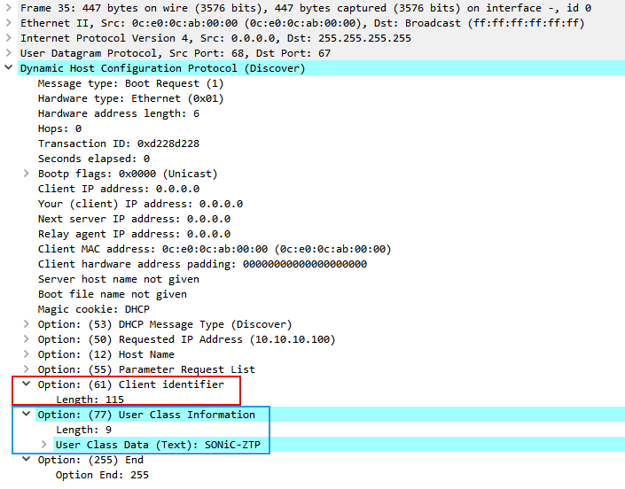
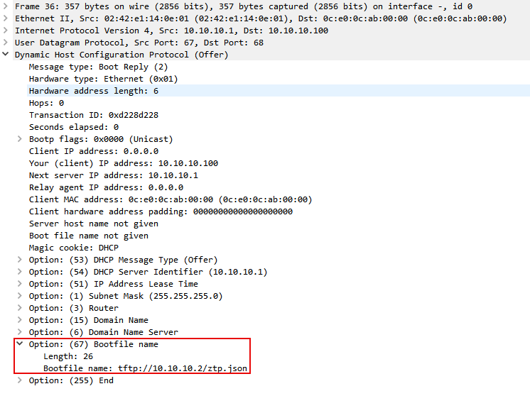
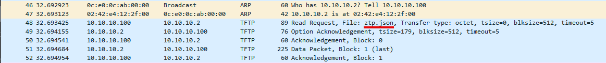
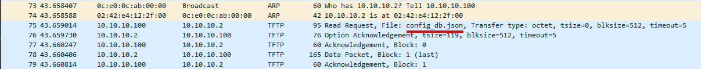

## SONiC ZTP Execution Flow

The [ZTP process in SONiC](https://github.com/sonic-net/SONiC/blob/master/doc/ztp/ztp.md) follows a structured workflow that determines how configuration artifacts are discovered and applied.

### Service Initialization and Boot Check

During system boot, the ZTP service checks whether a startup configuration file already exists in `/etc/sonic/config_db.json`. If a configuration is already present and ZTP is not explicitly forced by the administrator, the ZTP service terminates immediately. This behavior prevents the switch from overwriting an existing configuration every time it boots.

The rationale behind this design is to ensure that ZTP is used only during initial provisioning or when explicitly requested. Once a device has been configured and deployed, it should continue operating with its existing configuration unless a new provisioning workflow is intentionally triggered.

### Local File Check

If no startup configuration is found, the ZTP service checks for a locally stored provisioning file. This file may be packaged within the image or placed on disk before boot. If such a file exists and its status indicates that provisioning should continue, the switch skips network discovery and immediately processes the local ZTP instructions.

This mechanism allows administrators to pre-stage provisioning instructions locally, which can be useful in environments where DHCP or external provisioning infrastructure is not available.

### DHCP Discovery

If neither a startup configuration nor a local ZTP file is found, the switch attempts to obtain network connectivity. It broadcasts DHCP discovery messages across all available interfaces, including both management and in-band interfaces, using both IPv4 and IPv6.



The DHCP request generated by the ZTP service includes several identifying options. Among them is DHCP Option 77, which contains the user-class identifier `SONiC-ZTP`. This identifier allows DHCP servers to recognize that the requesting client is a SONiC device performing ZTP and to respond with appropriate provisioning information. To uniquely identify the device, the DHCP request also includes a client identifier (Option 61) constructed using the device’s hardware SKU and serial number.

### DHCP Offer

Once a DHCP server receives the discovery request, it responds with a DHCP offer that includes network parameters and potentially the provisioning URL. The switch selects the first interface that successfully receives an offer and treats it as the primary management interface.



### Payload Download and Staging

After confirming the DHCP parameters, the switch contacts the provisioning server and downloads the ZTP payload.



If the payload is a JSON file, it is stored locally on disk to `/host/ztp/ztp_data.json` so the ZTP engine can process it.

```text
$ cat /host/ztp/ztp_data.json
{
    "ztp": {
        "01-configdb-json": {
            "exit-code": 0,
            "halt-on-failure": false,
            "ignore-result": false,
            "reboot-on-failure": false,
            "reboot-on-success": false,
            "start-timestamp": "2026-03-08 22:24:47 UTC",
            "status": "SUCCESS",
            "timestamp": "2026-03-08 22:25:08 UTC",
            "url": {
                "destination": "/etc/sonic/config_db.json",
                "source": "tftp://10.10.10.2/config_db.json"
            }
        },
        "config-fallback": false,
        "halt-on-failure": false,
        "ignore-result": false,
        "reboot-on-failure": false,
        "reboot-on-success": false,
        "restart-ztp-no-config": true,
        "restart-ztp-on-failure": false,
        "start-timestamp": "2026-03-08 22:24:37 UTC",
        "status": "SUCCESS",
        "timestamp": "2026-03-08 22:25:08 UTC",
        "ztp-json-source": "dhcp-opt67 (eth0)",
        "ztp-json-version": "1.0"
    }
}
```

The service then parses the JSON structure and creates internal section files representing each configuration task. These section files allow the ZTP engine to track execution progress and maintain state across the provisioning workflow.

```text
$ cat /var/lib/ztp/sections/01-configdb-json/input.json
{
    "01-configdb-json": {
        "halt-on-failure": false,
        "ignore-result": false,
        "reboot-on-failure": false,
        "reboot-on-success": false,
        "status": "BOOT",
        "timestamp": "2026-03-08 22:24:37 UTC",
        "url": {
            "destination": "/etc/sonic/config_db.json",
            "source": "tftp://10.10.10.2/config_db.json"
        }
    }
}
```

### Processing and Artifact Execution

Each configuration section defined in the ZTP JSON file is processed sequentially. The ZTP engine invokes the appropriate plugin to execute the action described in the section. Depending on the configuration, this may involve downloading additional files, executing scripts, installing software images, or updating configuration databases.



The exit code returned by the plugin determines whether the step succeeded or failed. An exit code of zero indicates success, while non-zero values indicate an error that may trigger additional error-handling logic.

### Exit Conditions and Restart Logic

Once all sections have been processed, the ZTP service evaluates the overall result. The process is marked as successful only if all required steps complete successfully. If the provisioning process successfully generates a configuration database file, the switch continues operating with the new configuration. If the configuration file is still missing after execution, the ZTP engine restarts network discovery and attempts to retrieve a valid configuration again. Administrators can also manually interrupt the process using CLI commands, in which case the system falls back to a default configuration.
